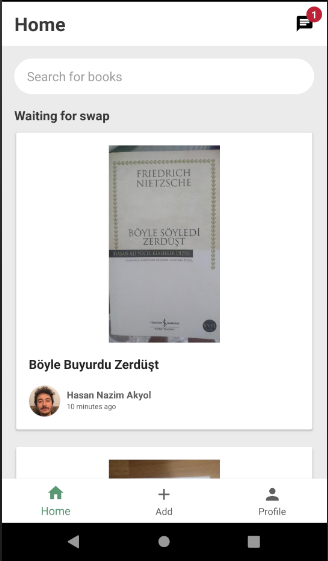

# BooCha
BooCha is a book trade Android Application.
## Overview
Nowadays, the usage of mobile applications is rapidly becoming widespread and it is   affecting the entire world. Shopping, holiday or transportation reservations, culture and art activities and almost all areas of our lives are benefiting from mobile applications. This mobile application allows book swapping and provides direct communication between readers.

The main aim of the project is to bring readers and the book together more easily. The increasing prices of publishers and the books that are hard to find in the sought-after edition cause some problems for the readers. 

With this project, we aimed to eliminate these difficulties and enable anyone who wants to easily obtain the book they want, read it and transfer it to another reader. Users will be able to add any book to their list for swap, assign a request to the other user for swap, and communicate with other users about swapping through the application. 

Users will have the opportunity to see the date of publication, the general description, the state of the book to be exchanged, the author and the image of the books which their want to swap. Readers will be able to create their own user profiles and create their libraries in three separate sections. These are; library, swappable and swapped parts.
## Technologies
### Kotlin
Kotlin is a general purpose, open source, statically typed “pragmatic” programming language for the JVM and Android that combines object-oriented and functional programming features. It is focused on interoperability, safety, clarity, and tooling support. 
### Firebase
Firebase is a mobile and web app development platform that provides developers with a plethora of tools and services to help them develop high-quality apps, grow their user base, and earn more profit.

These firebase services used; Cloud Firestore, Authentication, Firebase Storage.
### Google Books API
Google APIs is a set of application programming interfaces (APIs) developed by Google which allow communication with Google Services and their integration to other services.

Google Books is effort to make book content more discoverable on the Web. Using the Google Books API help that the application can perform full-text searches and retrieve book information, viewability and eBook availability. 
### Retrofit
Retrofit is a library that makes parsing an API response easy and handled better for consumption in the app. Retrofit is type-safe. Type safety means that the compiler will validate types while compiling, and throw an error if you try to assign the wrong type to a variable.
### Glide
Glide is an open source image loading and caching library for Android APPs developed by bumptech. It is fast, efficient and widely used image loading library, primarily focused on smooth scrolling. It is used in many popular Android Apps and one the most popular library for image loading and caching.  
### EventBus
EventBus is helpful for communication between fragments and activities. EventBus is an open-source library for Android and Java using the publisher/subscriber pattern for loose coupling. EventBus enables central communication to decoupled classes with just a few lines of code – simplifying the code, removing dependencies, and speeding up app development.
## Design Pattern
### MVVM
Model–view–viewmodel (MVVM) is a software architectural pattern.
MVVM facilitates a separation of development of the graphical user interface  from development of the business logic or back-end logic (the data model). 

The view model of MVVM is a value converter, meaning the view model is responsible for exposing (converting) the data objects from the model in such a way that objects are easily managed and presented. 
## Screenshots

   

  

  

 

License
--------

    MIT License

    Copyright (c) 2020 Hasan Nazım Akyol

    Permission is hereby granted, free of charge, to any person obtaining a copy
    of this software and associated documentation files (the "Software"), to deal
    in the Software without restriction, including without limitation the rights
    to use, copy, modify, merge, publish, distribute, sublicense, and/or sell
    copies of the Software, and to permit persons to whom the Software is
    furnished to do so, subject to the following conditions:

    The above copyright notice and this permission notice shall be included in all
    copies or substantial portions of the Software.

    THE SOFTWARE IS PROVIDED "AS IS", WITHOUT WARRANTY OF ANY KIND, EXPRESS OR
    IMPLIED, INCLUDING BUT NOT LIMITED TO THE WARRANTIES OF MERCHANTABILITY,
    FITNESS FOR A PARTICULAR PURPOSE AND NONINFRINGEMENT. IN NO EVENT SHALL THE
    AUTHORS OR COPYRIGHT HOLDERS BE LIABLE FOR ANY CLAIM, DAMAGES OR OTHER
    LIABILITY, WHETHER IN AN ACTION OF CONTRACT, TORT OR OTHERWISE, ARISING FROM,
    OUT OF OR IN CONNECTION WITH THE SOFTWARE OR THE USE OR OTHER DEALINGS IN THE
    SOFTWARE.
